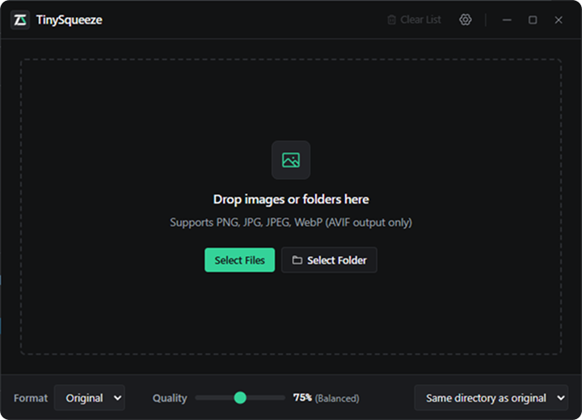
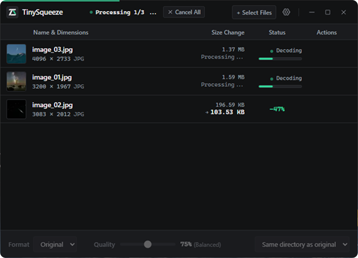
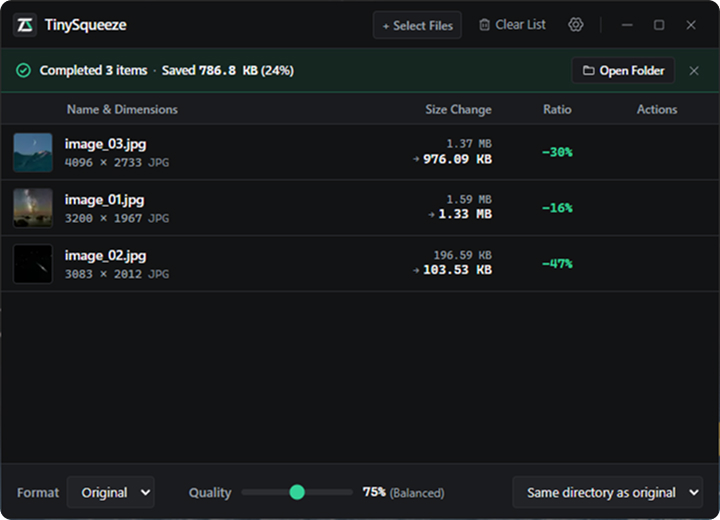

<div align="center">


# TinySqueeze

**A lightweight, privacy-first desktop tool for batch image compression and format conversion.**  
**極致輕量、本機離線的高效能批次圖片壓縮與轉檔工具**

[](https://github.com/kuozher/tinysqueeze/releases)
[](https://tauri.app/)
[](https://www.rust-lang.org/)
[](https://react.dev/)
[](https://tailwindcss.com/)
[](LICENSE)
[](https://deepmind.google/technologies/gemini/)

[English](#english) • [繁體中文](#繁體中文)

</div>

---

<a name="english"></a>
# English

## 📷 Interface Preview

| 1. Standby & Dropzone | 2. Live Compression Queue | 3. Batch Results & Filter |
| :---: | :---: | :---: |
|  |  |  |

---

## 💬 Author's Note

> *This project started as an experiment. I used to rely on services like TinyJPG, but wondered if modern AI could help construct a fast, self-contained desktop tool from scratch. While there are existing wrappers connecting to online APIs, building a native, zero-cost local version was surprisingly approachable—so why not give it a shot?*

---

## 🤖 AI Transparency & Disclosure

> **This project was implemented entirely using Google Gemini 3.8 Flash (High). Some improvement ideas were developed through interaction with Claude Sonnet 5.5 (medium), while the project direction, UI/UX review, and icon creation were conceived and executed by the author.**

---

## ✨ Key Features & Technical Highlights

TinySqueeze focuses on pure speed, visual quality, and rock-solid stability without unnecessary bloat:

- **🔒 100% Local & Privacy-First**:
  All encoding and decoding happen entirely on your device via native Rust cores. No network calls, no cloud servers, no API quotas or subscription fees. Your private photos and sensitive commercial graphics never leave your computer.
- **🧭 EXIF Orientation Auto-Correction**:
  Automatically normalizes camera and smartphone photo orientations based on EXIF metadata before stripping tags, guaranteeing thumbnails and compressed files are upright and distortion-free.
- **🎯 MozJPEG Perceptual Quantization & 4:4:4 Chroma Subsampling**:
  Traditional encoders default to aggressive 4:2:0 subsampling, causing blurry edges and bleeding on UI screenshots, graphics, and text. TinySqueeze uses perceptual quantization matrices (Ahumada-Watson) and preserves 4:4:4 chroma where needed, matching or surpassing TinyJPG's text crispness.
- **⚡ Dual-Lane Pipeline Architecture**:
  - **Fast Lane**: Extracts 80×80 WebP thumbnails in async background threads, converted to instant data URLs to bypass Windows WebView2 security sandbox restrictions with zero protocol overhead.
  - **Heavy Lane**: Scales workers dynamically based on CPU core count, governed by a `512MB` memory semaphore. Queueing hundreds of multi-megapixel images will never freeze the system or cause out-of-memory crashes.
- **📊 Non-blocking Sticky Result Bar**:
  Replaces disruptive modal popups with a top sticky result bar featuring smooth slide transitions. Shows overall space saved, processed counts, instant "Failed Only" filtering, and one-click opening of output destination folders.
- **⚙️ Advanced Conflict Management & Output Routing**:
  - 4 conflict resolution strategies: Auto Rename (`_1`), Overwrite, Skip, or Ask Individually (non-blocking per-item decision directly in the queue row).
  - Flexible destination options: same directory as original, relative subfolder (`min/`), or fixed global directory.
  - Customizable filename suffix with real-time preview (default `_min`).
- **🛡️ Anti-Bloat Guard & 100% Lossless Mode**:
  - Selecting `100%` quality triggers true mathematical lossless encoding.
  - If a compressed file ends up larger than the original due to edge-case noise, automatically keeps the original file.
- **💾 Atomic Writes, Cancel All & Temp Sweep**:
  Encodes to temporary files first and atomically renames them upon completion. Supports instant "Cancel All" with automatic worker termination and cold-startup cleanup for zero orphaned files.
- **🌓 Accessible Light/Dark Themes & Full Bilingual UI**:
  Features a high-contrast palette meeting WCAG AAA requirements in light mode (`#056547` primary accents with pure white text) and a distraction-free dark mode. Fully localized in Traditional Chinese and English with keyboard shortcuts (`Esc` to close drawers, `C` to clear, `R` to restart).

---

## 📦 Supported Formats

| Format | Decoding (Input) | Encoding (Output) | Highlights |
| :---: | :---: | :---: | :--- |
| **JPEG / JPG** | ✅ | ✅ | MozJPEG perceptual quantization, adaptive 4:4:4 chroma, EXIF auto-rotation |
| **PNG** | ✅ | ✅ | oxipng parallel filters, imagequant color quantization |
| **WebP** | ✅ | ✅ | Lossy compression & 100% pure mathematical lossless |
| **AVIF** | ❌ *(Output only)* | ✅ | High-efficiency next-gen compression via ravif (Encoding output only) |
| **Original** | — | ✅ | Preserves original extension while slimming file size |

---

## 📥 Installation & Downloads

Pre-built binaries for Windows (x64) are available on [GitHub Releases](https://github.com/kuozher/tinysqueeze/releases):

- **Windows Setup Installer (`TinySqueeze_1.3.3_x64-setup.exe` / `.msi`)**: Standard installation with Start Menu integration and uninstaller.
- **Windows Portable Edition (`TinySqueeze_v1.3.3_x64_portable.zip` / `TinySqueeze.exe`)**: Standalone binary ready to run immediately from a flash drive or desktop without installation.

> [!NOTE]
> **Windows SmartScreen Notice**:  
> Because TinySqueeze is a free, open-source project without a paid commercial EV Code Signing Certificate, Windows Defender SmartScreen may display a warning:
> *"Windows protected your PC — Microsoft Defender SmartScreen prevented an unrecognized app from starting."*  
> **How to proceed:**
> 1. Click **More info** (*其他資訊*).
> 2. Click **Run anyway** (*仍要執行*).  
> The entire codebase is open-source under the MIT license, completely transparent, and safe to inspect.

---

## 🛠️ Building from Source

### Prerequisites
1. **Node.js** (v18+ recommended)
2. **Rust & Cargo** (v1.78+ recommended, 2021 edition)
3. C++ Build Tools (e.g. Visual Studio Build Tools with C++ workload on Windows)

```bash
# Clone the repository
git clone https://github.com/kuozher/tinysqueeze.git
cd tinysqueeze

# Install frontend dependencies
npm install

# Run in development mode
npm run tauri dev

# Build production bundle (.exe / .msi)
npm run tauri build
```

---

<a name="繁體中文"></a>
# 繁體中文

## 📷 介面預覽

| 1. 待機拖曳區 | 2. 轉檔佇列與縮圖預覽 | 3. 頂部結算條與篩選 |
| :---: | :---: | :---: |
|  |  |  |

---

## 💬 作者碎碎唸

> 這個專案就是個實驗，原先用 tinyjpg 這類服務，但想到 AI 也許也能做個簡單快速的版本，就陸陸續續架構出來。其實也是有利用 API 套 GUI 的現成項目，但既然動手的成本不高，那就來試試吧～

---

## 🤖 AI 參與揭露

> **本專案程式全程使用 Google Gemini 3.8 Flash (High) 實做，部份改進構思是與 claude sonnet 5.5 (medium)互動，並由作者本人構思專案方向、審核 UI/UX、製作 icon。**

---

## ✨ 核心特色與技術專門

TinySqueeze 專注於極致輕快、安全無損的本機圖片壓縮與格式轉換體驗：

- **🔒 100% 本機原生運行，零隱私洩漏**：
  所有編解碼皆由 Rust 本機核心原生運算。無任何網路請求、不依賴外部 Python/Node.js runtime、無雲端 API 額度限制，商業設計稿與敏感照片絕不上雲。
- **🧭 EXIF 方向自動導正**：
  在抹除中繼資料以保護隱私前，自動解析數位相機與手機拍攝之 EXIF 旋轉標記並物理轉正像素，徹底解決壓縮後照片歪斜翻轉的問題。
- **🎯 MozJPEG 感知量化與自適應採樣（對標 TinyJPG 銳利度）**：
  傳統工具預設強制 4:2:0 色度降採樣，造成文字邊緣模糊發虛與色彩滲透。TinySqueeze 整合 Ahumada-Watson 感知量化矩陣與自適應 4:4:4 色度採樣，在大幅瘦身同時維持細緻文字線條。
- **⚡ 雙通道管線架構與記憶體水線**：
  - **Fast Lane（極速通道）**：拖入檔案即刻由非同步背景執行緒抽取輕量 80×80 WebP 縮圖，直接以 Base64 Data URL 傳遞給前端，徹底規避 Windows WebView2 沙盒自訂協議限制，達到零延遲即時呈現。
  - **Heavy Lane（編碼通道）**：動態依 CPU 核心分配編碼執行緒，並受 `512MB` 記憶體門禁計數器（Semaphore）保護，百張大圖同時拖入不爆記憶體。
- **📊 頂部平滑滑動結算條**：
  捨棄打斷操作流程的中間彈窗，改採頂部非阻塞滑動結算條。清晰回報整體節省體積、完成張數、一鍵開啟輸出目的地資料夾，並支援「僅看失敗」即時排錯篩選。
- **⚙️ 靈活檔案衝突管理與自訂輸出目錄**：
  - 提供 4 種同名衝突策略：自動添加序號後綴（`_1`）、直接覆蓋、跳過不處理、單獨詢問（直接在任務列表行內選擇，非阻塞佇列）。
  - 多樣輸出路徑模式：原檔同層、原檔相對子資料夾（`min/`）、全域固定目錄。
  - 支援檔名自訂後綴（預設 `_min`）並具備即時效果預覽。
- **🛡️ 負向膨脹防禦與 100% 真無損**：
  - 當品質拉至 100% 時，自動啟動純數學無損編碼。
  - 若壓縮後體積反向膨脹，自動維持原檔輸出，杜絕越壓越大的情況。
- **💾 原子落盤、立即取消與孤兒暫存防禦**：
  採暫存檔寫入後原子替換（Atomic Rename），支援「取消全部」立即中斷所有背景執行緒與清掃暫存；搭配冷啟動掃描器，程式異常中斷亦能自動回收孤兒暫存檔。
- **🌓 高可讀性雙色模式與雙語系支援**：
  淺色模式完全符合 WCAG AAA 高對比規範（綠色底 `#056547` 搭配純白字體），搭配暗色工具箱美學。支援繁體中文與英文即時切換，並完整支援 `Esc` 關閉設定側欄、`C` 清空列表、`R` 快速重跑等鍵盤快捷鍵。

---

## 📦 支援格式

| 格式 | 解碼輸入 (Input) | 編碼輸出 (Output) | 特色說明 |
| :---: | :---: | :---: | :--- |
| **JPEG / JPG** | ✅ | ✅ | MozJPEG 感知量化、自適應 4:4:4 色度採樣、EXIF 自動轉正 |
| **PNG** | ✅ | ✅ | oxipng 並發濾鏡優化、色彩量化 (imagequant) |
| **WebP** | ✅ | ✅ | 支援一般有損壓縮與 100% 純數學無損編碼 |
| **AVIF** | ❌（僅限輸出） | ✅ | ravif 次世代高壓縮比輸出（為保持二進位極致輕量，目前不支援作為來源圖檔解碼輸入） |
| **原格式 (Original)** | — | ✅ | 自動沿用原圖副檔名並進行高效瘦身 |

---

## 📥 安裝與發行下載

可於 [GitHub Releases](https://github.com/kuozher/tinysqueeze/releases) 取得 Windows (x64) 預編譯檔案：

- **Windows 安裝檔 (`TinySqueeze_1.3.3_x64-setup.exe` / `.msi`)**：標準安裝程式，具備開始功能表捷徑與卸載支援。
- **免安裝可攜版 (`TinySqueeze_v1.3.3_x64_portable.zip` / `TinySqueeze.exe`)**：解壓縮或直接點擊即可在任何資料夾、USB 隨身碟中執行，不殘留系統註冊表。

> [!NOTE]
> **Windows SmartScreen 提示說明**：  
> 由於 TinySqueeze 為個人開源項目，尚未購買昂貴的微軟商業 EV 程式碼簽章憑證，因此在 Windows 安裝或首次執行時，系統可能彈出防護提示：  
> *「Windows 已保護您的電腦 — Microsoft Defender SmartScreen 已防止未辨識的應用程式啟動。」*  
> **操作方式：**
> 1. 點擊彈窗上的 **「其他資訊」**（*More info*）。
> 2. 點擊 **「仍要執行」**（*Run anyway*）。  
> 本專案為 100% 開源軟體（MIT License），所有原始碼公開透明，請安心使用。

---

## 🛠️ 本地建置與編譯

```bash
# 複製專案
git clone https://github.com/kuozher/tinysqueeze.git
cd tinysqueeze

# 安裝前端相依套件
npm install

# 啟動開發熱重載模式
npm run tauri dev

# 打包生產發行安裝檔 (.exe / .msi)
npm run tauri build
```

---

## 📄 開源授權 (License)

本專案採用 [MIT License](LICENSE) 開源授權。
